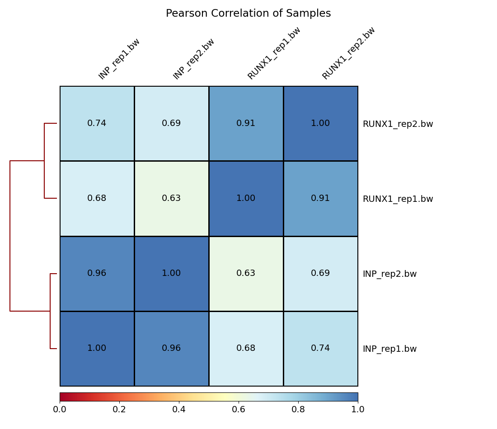
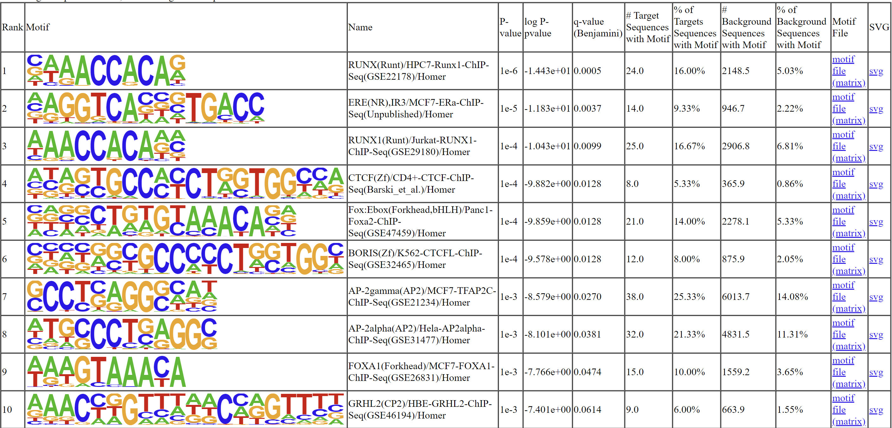
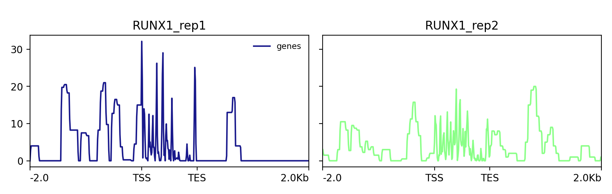
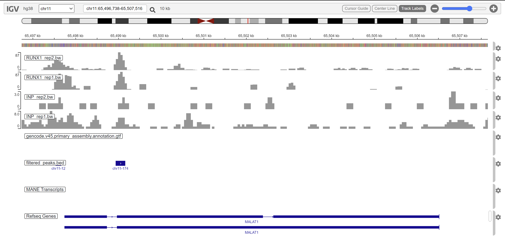

**Methods and Quality Control**
1. Include a full methods section for this project. You may simply combine
the individual methods sections you've written for each week.
```
The analysis was conducted in high-performance computing environments. Specifically utilizing Miniconda, Github, and the Boston University Shared Computing Cluster (SCC), which provided the necessary computational resources. The analysis aims to replicate Figure 2 and relevant sections from the supplementary material to perform common preliminary Chip-seq analyses. The reads files were downloaded using the reference paper's listed GEO accession from the EMBI-ENA website using wget.

Data Quality Control (FastQC, MultiQC, Trimmomatic):
The analysis pipeline incorporated packages from Conda-Forge and Bioconda channels. Fastqc(v.0.12.1-0), a bioinformatics software tool, was used for quality control on the FastQ files. FastQC performs quality control assessments on sequence data. A Snakemake workflow was developed to automate the execution of FastQC on each of the 4 read files. The Snakemake workflow also included a rule to run Trimmomatic(v.0.39) on the FastQ file using an adapter file. Trimmomatic is a bioinformatics software tool that is used for data cleaning by performing various trimming and filtering operations on raw reads. The specific parameters used included ILLUMINACLIP for adapter trimming and quality thresholds of leading 3, trailing 3, and sliding window 4:15 for trimming low-quality bases. Finally, with Bowtie2(v.2.5.3), a full genome index for GRCh38 human reference genome was generated. This index will be essential for the effective alignment of reads to the reference genome. This analysis was completed in approximately 20 minutes.

Data Processing and Analysis (Alignment, Sorting, Quality Control):
The pipeline continued to incorporate bowtie2(v.2.5.3) for its aligner to align the reads to the previously created full genome index. The alignments were converted to BAM format using samtools(v1.19.2). Again, using samtools, these alignment files were sorted and indexed using samtools sort and index functions. Samtools' flagstat function was used to quality check the aligned files of which MultiQC (v1.20) was used to aggregate and visualize the quality control results across all samples. To perform quantitative analysis and visualization, the BAM files needed to be converted to a bigWig format, which used deeptools(v3.5.4) bamCoverage. Additionally, a correlation matrix was generated using deeptools' multiBigwigSummary and plotCorrelation utilities to assess the similarity between samples based on their signal profiles.

Peak Calling and Annotation (HOMER, Bedtools):
Using HOMER(v4.11) to perform peak calling identifies regions of significant enrichment in the localization of the alignments. To determine a set of reproducible peaks, bedtools(v2.31.1) were used to generate a single list for each replicate following an intersect strategy. Bedtools was again used to filter out peaks that fell into known signal-artifact regions, as these are typically noise and not representative of the target enrichment. To annotate the reproducible peaks, the primary assembly annotation was used to annotate them to their nearest genomic features and ultimately gain some insight into the genomic context of these peaks. On our list of filtered, reproducible peak,s the findMotifsGenome.pl utility of HOMER was used to perform motif enrichment analysis against the hg38 build of the human reference genome. This was done to identify enriched motifs within the reproducible peaks.

Visualize and Analyze Data (UCSC Table Browser, IGV, deeptools):
The UCSC Table Browser was used to extract the genomic coordinates for all genes in the hg28 reference genome. The resulting file contains the TSS/TTS locations for every gene. This will then be used along with associated bigWig files to generate visualizations of Runx1 signal coverage across gene bodies. Deeptools were used to calculate signal values, generate signal coverage plots across gene bodies, and calculate scores within 2kb upstream and downstream of the TSS and TTS gene body regions. The Integrative Genomics Viewer (IGV) from the Broad Institute, along with the sample files, reproducible peaks, and the primary assembly GTF file containing annotations for our reference genome, was used to visualize peaks in promoter regions of key genes. Specifically focusing on MALAT2 and NEAT1 t0 reproduce figures 2d and 2e from the reference paper, respectively. In addition to generating gene body signal coverage plots, ChIPseq data, and the RNAseq results were combined to reproduce figures 2f and supplementary figure s2d from the original publication using R(v.4.2.1). The original filters and cutoffs were used (padj<0.01 and log2FoldChange>1) when processing the DESeq2 results for RNAseq experiments from the paper.
```

2. Examine the figure provided below:
```{r, dup rate}
knitr::include_graphics("fastqc_sequence_counts_plot.png")
```
Notice the duplication rates between the IP (Runx1) and the Input control samples.
Provide an explanation for why they are so different. Also, make sure to note
whether you think this represents an issue with the dataset, and if so, why?
```
There are far more duplications in the IP than in the control samples. This could be because the IP samples are specifically enriched for DNA fragments bound by the Runx1 transcription factor. This enrichment process can lead to a higher proportion of identical DNA fragments in the IP samples, resulting in increased duplication rates. On the other hand, the Input control samples represent the background genomic DNA without specific enrichment for Runx1 binding, leading to lower duplication rates. I do not think this difference represents an issue with the dataset. 
```

2. Examine the figure provided below:
```{r, GC content}
knitr::include_graphics("fastqc_per_sequence_gc_content_plot.png")
```
Consider the GC plot for the IP and Input control samples. The two input samples
are represented by the red distributions, and the IP samples are the green
distributions.
Why do you think we see a difference in the GC distribution between our IP and
Input control samples? Also, make sure to note whether you think this represents
an issue with the dataset, and if so, why?
```
The control samples have a main peak at 40% GC. The IP samples have one main peak at around 50% GC. This difference could be because the IP samples are specifically enriched for DNA fragments bound by the Runx1 transcription factor. This targeted enrichment can introduce bias in the GC content distribution, especially if RUNX1 preferentially binds to genomic regions with specific GC content profiles. As a result, the GC content distribution in IP samples may exhibit differences compared to the Input control samples, which represent the overall genomic DNA without enrichment. I do not think this difference represents an issue with the dataset.
```

**Thought Questions on Publication**
3. First, please report the following results:
A. How many peaks were called in each of the biological replicates in your
results?
```
Replicate 1 has 106072 peaks, and replicate 2 has 50952 peaks.
```

B. How many "reproducible" peaks did you end up with after applying your
bedtools intersect strategy on the two replicate peak sets?
```
There were 10924 reproducible peaks.
```

C. How many "reproducible" peaks remained after filtering out any peaks found in the hg38 blacklisted regions?
```
There were 10785 filtered reproducible peaks.
```

Consider Supplementary Figure S2C, do you obtain the same number of Runx1
peaks for each replicate experiment? Do you obtain the same number of
reproducible peaks? If not, provide at least three reasons why your results
differ.
```
In supplementary figure S2C, there were 3983 peaks in replicate 1, 10465 peaks in replicate 2, and 3466 "reproducible peaks" in RUNX1. These are not the same numbers that I got and could be due to differences in alignment parameters or peak calling thresholds during data processing, different peak merging strategies, differences in software versions utilized within the pipeline, or differences in the versions of the reference genome assembly and annotations.
```

4. Consider figure 2a, notice that around 1/3 of all of their reported
Reproducible peaks are annotated to intergenic regions (regions of the genome
not associated with any known genes). Propose at least two experiments (or sets
of experiments) That would help you begin to understand whether these peaks are
biologically relevant.
```
One experiment could be performing functional genomics screening using CRISPR-Cas9 knockout or RNA interference (RNAi) techniques targeting the genomic regions annotated to the intergenic peaks. Then evaluate the phenotypic effects on cell behavior, gene expression, or other relevant molecular processes to determine if these regions play a biological role. Another experiment could be to conduct gene expression profiling experiments, such as RNA-seq or microarray analysis, in conditions where the intergenic peaks could be activated or inactivated. Then perform network analysis to identify potential regulatory or signaling pathways involving these regions and assess their impact on gene expression and cellular phenotypes.
```

5. Consider Figure 2f. Note that many of the genes that are differentially
expressed upon Runx1 knockdown do **not** have a proximal Runx1 binding peak.
Provide at least three reasons for why this might be the case.
```
One reason could be that RUNX1 can regulate gene expression indirectly through complex regulatory networks. It may act upstream or downstream of other signaling pathways that modulate expression. Another reason could be that RUNX1 binding is context-specific, meaning it may bind to different genomic regions under different cellular conditions or in specific cell types. The third possible reason could be that RUNX1 binding peaks may appear or disappear at different stages of cellular development or in response to stimuli.
```

**Reporting your results**
Please display your correlation plot displaying the overall similarity between
your sample files based on the read coverage scores across genomic regions:
```{r, correlation heatmap from plotCorrelation}

```

Please include a screenshot of the top ten results from the knownResults output
from motif finding with HOMER findMotifsGenome:
```{r, motif results from findMotifsGenome}

```

Please include the signal coverage plot you generated in week 4. This is the 
output of plotProfile that shows the density of Runx1 binding across all of the
hg38 gene bodies. You only need to show one representative plot:
```{r, signal coverage plots from plotProfile}

```

Please include one of the screenshots of the genome browser view of either the
MALAT1 or NEAT1 locus with your bigWig files and BED file. You only need to
include one:
```{r, NEAT1 or MALAT1 genome browser view with tracks}

```
